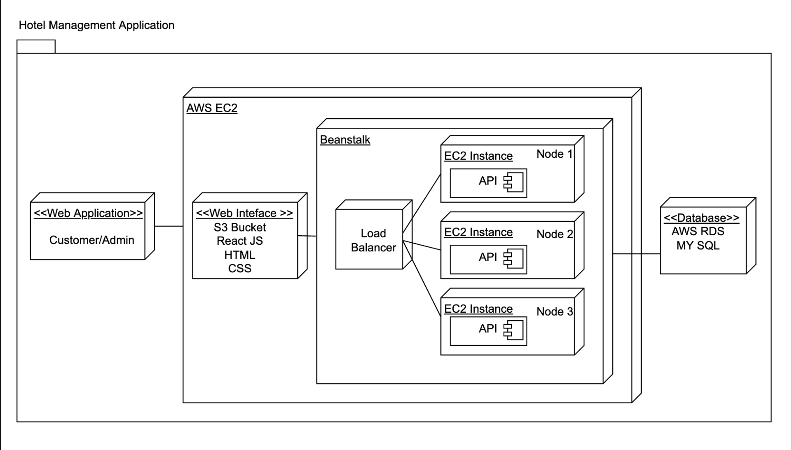
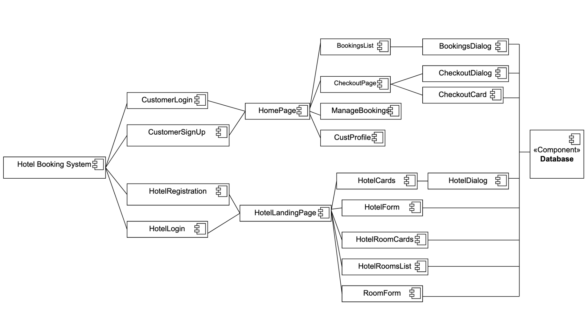

# team-project-code_team15
team-project-code_team15 created by GitHub Classroom

### Team:
1. Sai Abhiram Atluri(015912871)
2. Sai Harsha Anirudh Garre (015218996)
3. Anuhya Gankidi (015897323)
4. Manikanta Tanniru (015947425)

#### Team Contributions: 
* Abhiram - Frontend: HomePage, NavBar, Search Hotels ; Backend: API's for Homepage, Search, Checkout. 
* Harsha - Frontend: Rewards, Hotel pages ; Backend: APIs for Manage Rewards, AWS configurations.
* Anuhya - Frontend: MyBookings, Manage Bookings-Edit,Cancel Reservations; Backend - API's for view bookings, manage bookings
* Manikanta - Frontend: Login, Registration for Customer, Admin. Backend: DB, mockdata to DB

#### XP Values:
Feedback and Communication (Weekly status update calls)
We communicated regularly online and offline. We had status updates twice every week through calls, zoom and whatsapp. 

#### git repo: 
https://github.com/gopinathsjsu/team-project-code_team15

#### project board: 
https://github.com/gopinathsjsu/team-project-code_team15/projects/1

#### Sprint Task Sheet:
https://github.com/gopinathsjsu/team-project-code_team15/blob/main/Team%20Code%20Sprint%20Sheet.xlsx

#### How to run the web-app:

* Step 1: Clone the app by command " git clone https://github.com/gopinathsjsu/team-project-code_team15"
* Step 2: Go to the client directory and install node modules by command "npm i OR npm install"
* Step 3: Run the client by command "npm start"
* Step 4: Go to the server directory and install node modules "npm i OR npm install"
* Step 5: Run the server by command "node app.js"

#### Tech Stack
* Frontend: React JS, HTML5, CSS
* Backend: Node JS Express JS 
* Database: MySQL (hosted on Amazon RDS) 
* Deployment : Amazon EC2 Autoscaled cluster with Load balancing

#### Feature Set:
1. Customer Registration and Login.
2. Hotel Employee Register and Login.
3. Search for Rooms at a desired location and date.
4. Display list of available rooms and amenities.
5. Book a room with selected amenities.
6. Proceed to checkout, include rewards and confirm booking.
7. View all the bookings.
8. Edit the booking.
9. Cancel a booking.
10. Hotel can add and update rooms.

#### Diagrams:
##### Architechture Diagram:

##### Deployment Diagram:

##### Component Diagram:

